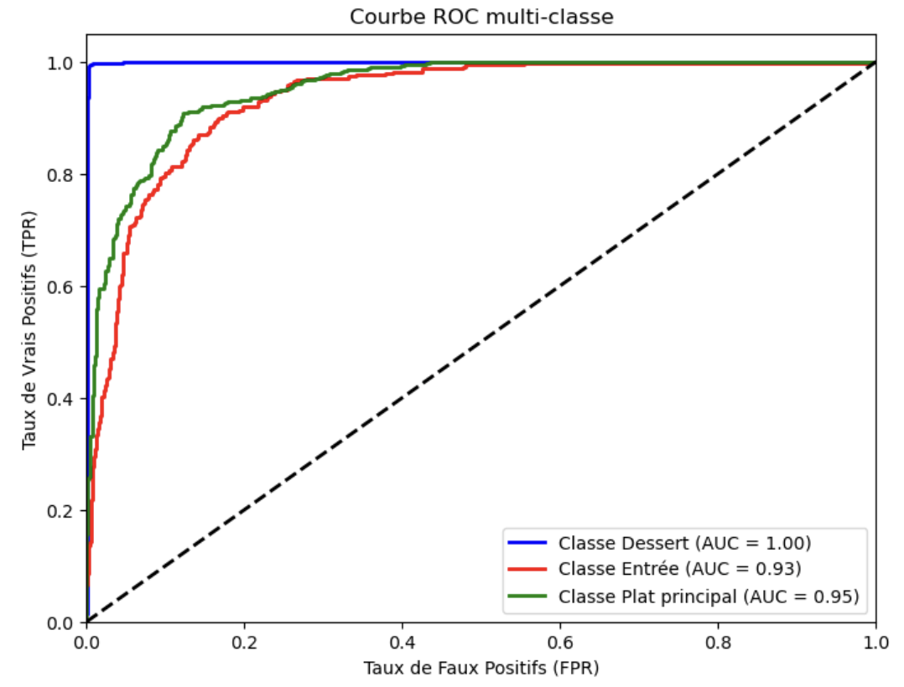
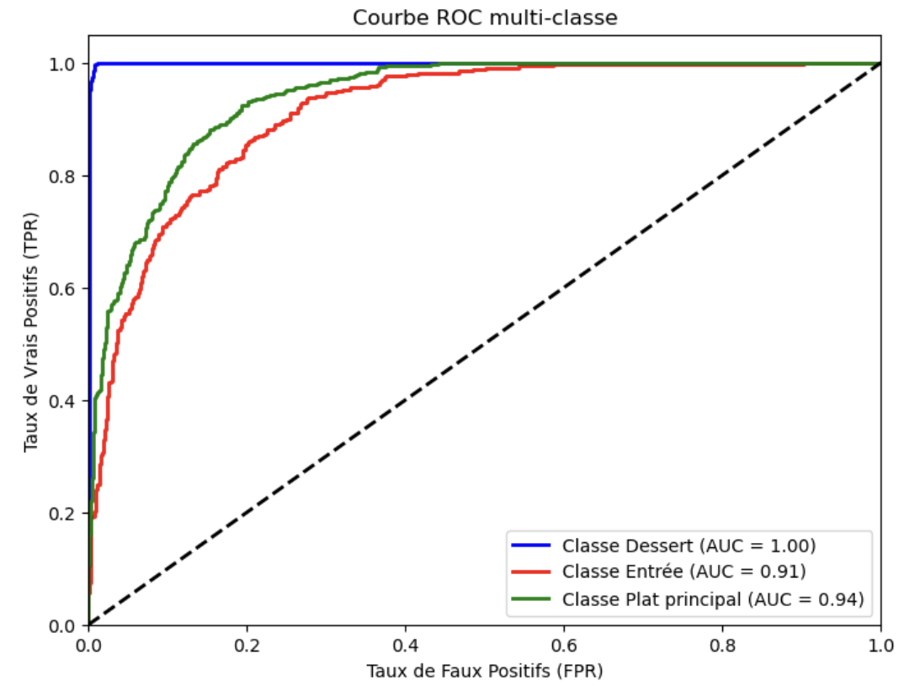
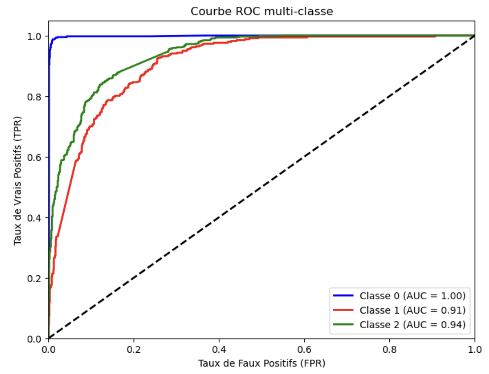
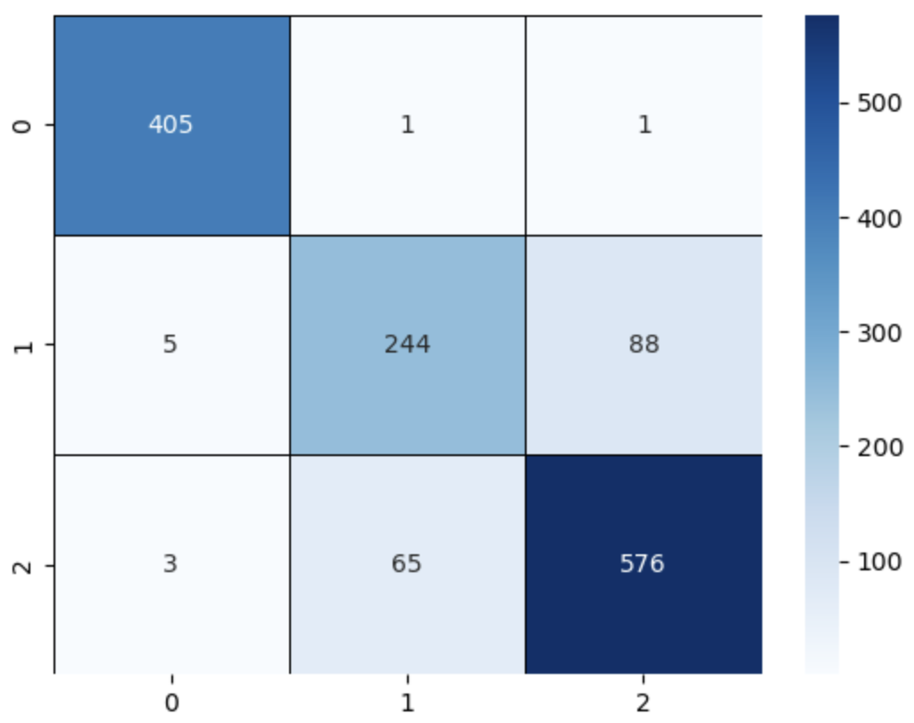
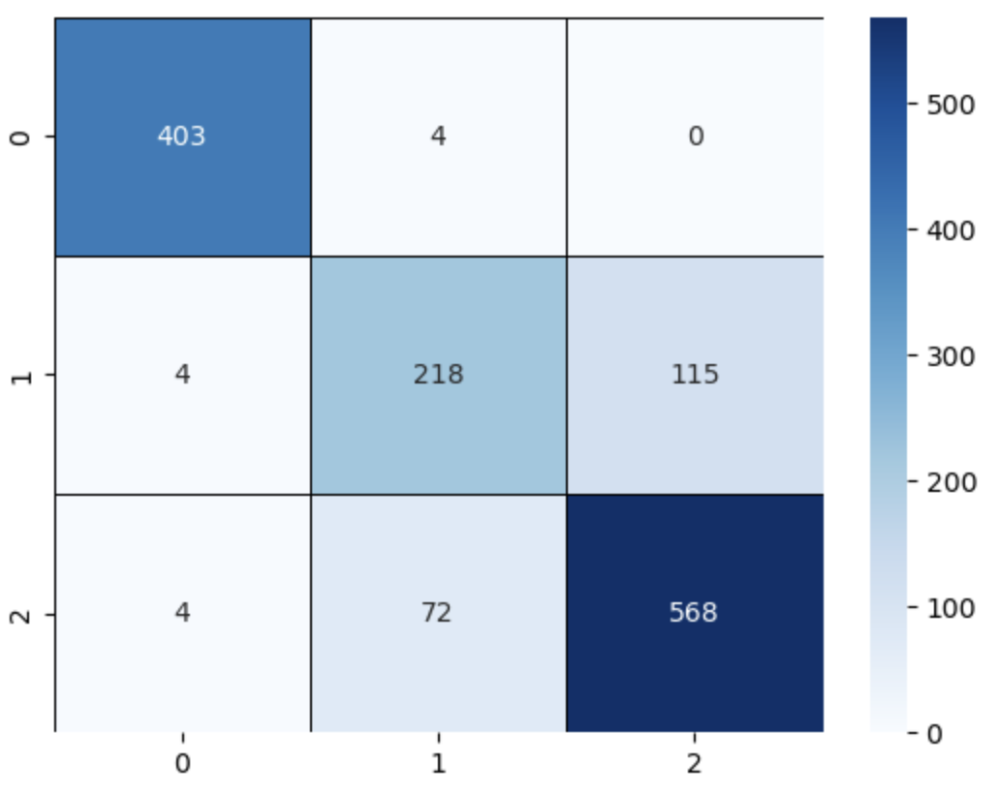
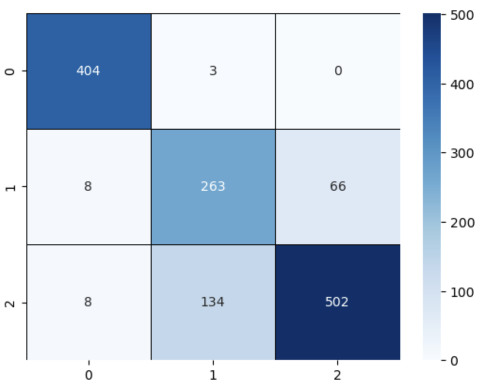

# DEFT2013 Tâche 2 :
- GIRAUD Thomas
- LE LANNIC Maëlle

## Description de la tâche
L'objectif de ce projet est de prédire le type de la recette grâce à un modèle entraîner sur un jeu de données comportant des documents représentant des recettes d'entrée, de dessert et de plat principal. 

### Exemple d'un document : recette_221358.xml
Titre : "Feuilleté de saumon et de poireau, sauce aux crevettes"

Type : Plat principal 

Difficulté : Facile

Coût : moyen 

Ingrédients :
- 1 gros pavé de saumon 
- 100 g de crevettes décortiquées 
- 2 poireaux moyens 
- 1 oignon  
- 1 pâte feuilletée 
- 25 cl de crème liquide épaisse 
- Un peu de vin blanc 
- 1/2 citron jaune 
- 1 jaune d'oeuf 
- Un peu d'huile d'olive  
- Une noisette de beurre 
- Sel, aneth"

Recette : Couper finement le blanc et un peu de vert des poireaux en rondelle. Éplucher et couper l'oignon. Faire chauffer l'huile d'olive et le beurre dans une poêle. Y faire revenir à feu doux les poireaux et l'oignon environ 15 minutes. En fin de cuisson ajouter le vin blanc, un peu d'aneth et du sel. Pendant ce temps faire cuire le saumon dans une poêle huilée. En fin de cuisson le faire griller sur feu vif. Préparer la sauce : mélanger les crevettes, le 1/2 citron jaune, la crème, le sel et l'aneth. Ajouter un peu de sauce à la préparation des poireaux. Préchauffer le four à 200°C (thermostat 6-7.Étaler la pâte feuilletée et la couper en 2. Sur une moitié disposer la préparation au poireaux. Disposer le saumon sur les poireaux. Y verser un peu de sauce sur le dessus (garder le reste de sauce au frigo). Refermer le chausson à l'aide de l'autre moitié de la pâte feuilleté. Bien appuyer sur les bords. Étaler le jaune d’œuf sur le dessus à l'aide d'un pinceau. Enfourner environ 20 minutes. Avant de servir chauffer la sauce et la servir à côté du feuilleté.On peut servir ce feuilleté avec une salade verte.

## Statistiques corpus
### Nombre de document dans le corpus
Le corpus est constitué de 3 fichier data (csv):
- un fichier test avec 1 388 données, 
- deux fichiers obtenu à partir du fichier train_all qui a été séparé en deux 
    - un fichier train (90%) avec 11 225 données
    - un fichier validation (10%) avec 1 248 données 

### Répartition des étiquettes dans chacun des sous-ensemble
test.cvs
- Entrée : 337
- Plat principal : 644
- Dessert : 407

train.csv
- Entrée : 2615
- Plat principal : 5230
- Dessert : 3380

validation.csv
- Entrée : 294
- Plat principal : 572
- Dessert : 382

train_all.csv
- Entrée : 2909
- Plat principal : 5802
- Dessert : 3762

## Méthodes proposées
### Run1: baseline (méthode de référence)
Description de la méthode:
- classifieur utilisé : prédiction de manière aléatoire

### Run2: TF_IDF 
Description de la méthode:
- descripteurs utilisés : TF-IDF
- classifieur utilisé : SVC

On commence par tokeniser chaque mot d’une recette et supprimer les mots outils avec `simple_process`. Ensuite, on transforme chaque recette en vecteurs numériques avec **TF-IDF** (`TfidfVectorizer`) pour quantifier l'importance des mots. Puis, on utilise ces vecteurs pour entraîner un modèle **SVM (Support Vector Machine)**, qui permet de classifier les recettes en fonction de leur type. Enfin, on mesure les performances du modèle à l'aide du **classification report**.

### Run3: Word2Vec
Description de la méthode:
- descripteurs utilisés : Word2Vec
- classifieur utilisé : SVC

On commence par tokeniser chaque mot d’une recette et supprimer les mots outils. Ensuite, on entraîne un modèle Word2Vec sur les données tokenisées pour transformer les recettes en vecteurs numériques, en capturant les relations sémantiques entre les mots. On calcule la moyenne des vecteurs de chaque recette, ces vecteurs servant d'entrée pour un modèle SVM (Support Vector Machine), qui est entraîné pour classifier les recettes en fonction de leur type. Enfin, on mesure les performances du modèle à l'aide du **classification report**.

### Run4: MLP
Description de la méthode:
- descripteurs utilisés : Word2Vec
- classifieur utilisé : MLP (avec pytorch)

On commence par tokeniser chaque mot d’une recette et supprimer les mots outils. Pour transformer ces données en vecteurs numériques, on utilise un modèle **Word2Vec** qui capture les relations sémantiques entre les mots. Une fois le modèle entraîné, chaque texte est converti en un vecteur moyen. Ces vecteurs de textes sont ensuite transformés en tenseurs PyTorch pour être utilisés dans un réseau neuronal.

Le modèle choisi est un réseau neuronal à trois couches entièrement connectées, avec une fonction d'activation **ReLU** et une fonction de perte **CrossEntropyLoss**. Le réseau est entraîné sur les données d'entraînement, et ses performances sont évaluées sur le jeu de validation à chaque époque. L'optimisation du modèle est effectuée à l'aide de l'algorithme **Adam**.

Après l'entraînement, les prédictions sont réalisées sur le jeu de test, et les performances du modèle sont mesurées à l'aide de la **précision** et du **classification report**.

## Résultats
| Run                | Accuracy |    f1 Score    |
| ------------------ | --------:| --------------:|
| baseline           |   0.37   | 0.31 0.26 0.46 |
| TF-IDF             |   0.88   | 0.99 0.75 0.88 |
| Word2Vec           |   0.86   | 0.99 0.69 0.86 |
| MLP                |   0.84   | 0.98 0.71 0.83 |

### Analyse de résultats
#### Combien de documents ont un score de 0 ? de 0.5 ? de 1 ? 
Run 2 TF-IDF : 
- Documents avec un score de 0 : 0
- Documents avec un score inférieur à 0.5 : 5
- Documents avec un score entre 0.5 et 1 : 1383

Run 3 Word2Vec :
- Documents avec un score de 0 : 0
- Documents avec un score inférieur à 0.5 : 8
- Documents avec un score entre 0.5 et 1 : 1380

Run 4 MLP : 
- Documents avec un score de 0 : 0
- Documents avec un score inférieur à 0.5 : 16
- Documents avec un score entre 0.5 et 1 : 1372

##### TF-IDF

##### Word2Vec

##### MLP

#### Y-a-t-il des régularités dans les document bien/mal classifiés ?
On remarque une régularité dans les documents bien et mal classifiés. Globalement, les courbes de ROC de chaque approche sont semblable. Pour chaque approche, le score AUC (air sous la courbe) de dessert est toujours à 1, pour entrée sa varie entre 0.91 et 0.93 et pour plat entre 0.94 et 0.95. 

Une bonne prédiction se traduit par un score AUC élevé donc on peut en conclure que les résultats son plutôt bon et assez proche pour chaque méthode. 

#### Où est-ce que l'approche se trompe ? (matrice de confusion)
On remarque que la plus part des modèles perdent de la précision car ils se trompent sur quelques entrée qu'il classe en plat principal et inversement.

##### TF-IDF

##### Word2Vec

##### MLP

#### Quels sont les descripteurs les plus décisifs 
En observant les résultats obtenus avec le RUN n°2 et le RUN n°3, les deux ayant été classifié par un modèle SVC, on remarque que le descripteurs TF-IDF (0.88) semble être plus précis que Word2Vec (0.86). 

### Conclusion
Globalement, les scores sont bons mais pourraient être amélioré. Pour ce faire, on pourrait ajouter la racination. C'est à dire réduire les mots à leur racine. De plus pour le réseau de neurone, une modification des paramètres (nombre de couche, de neurone, taux de ) permettrait probablement d'avoir une meilleure accuracy. 

Une approche en utilisant des modèles pré-entraîner (camembert, bert) permettrait potentiellement d'avoir de meilleur résultat. 